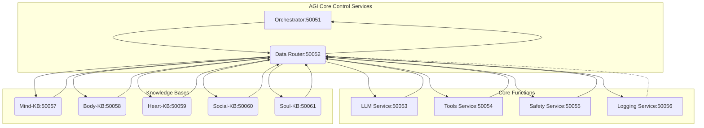

# Master Orchestrator AGI System - Architecture Workflow

This document visualizes the core communication blueprint for the Master Orchestrator AGI System.

## System Architecture Diagram

## Service Port Mapping

| Service | Port | Description |
|---------|------|-------------|
| Orchestrator | 50051 | High-level coordination and planning |
| Data Router | 50052 | Central communication hub |
| LLM Service | 50053 | Natural language processing |
| Tools Service | 50054 | External world interaction |
| Safety Service | 50055 | Policy enforcement |
| Logging Service | 50056 | Centralized telemetry |
| Mind-KB | 50057 | Short-term, episodic memory |
| Body-KB | 50058 | Physical/digital embodiment |
| Heart-KB | 50059 | Personality, emotional state |
| Social-KB | 50060 | Social dynamics, relationships |
| Soul-KB | 50061 | Core values, identity |

## Communication Flow

1. **User Request** → Orchestrator (50051)
2. **Planning Phase** → Orchestrator calls LLM Service via Data Router
3. **Safety Validation** → Orchestrator calls Safety Service via Data Router
4. **Execution Phase** → Orchestrator routes requests via Data Router to target services
5. **Response Aggregation** → Data Router returns responses to Orchestrator
6. **Final Response** → Orchestrator returns aggregated result to user

## Data Router Central Role

The Data Router (50052) serves as the central nervous system:
- All inter-service communication flows through the Data Router
- The Data Router maintains client connections to all 9 downstream services
- Service discovery and routing logic is centralized in the Data Router
- The Orchestrator only needs to know about the Data Router

## Network Topology

- **Bridge Network**: `agi_network` (Docker)
- **Service Discovery**: Docker DNS (e.g., `http://llm-service:50053`)
- **Protocol**: gRPC (Tonic) over HTTP/2
- **Serialization**: Protocol Buffers (protobuf)

