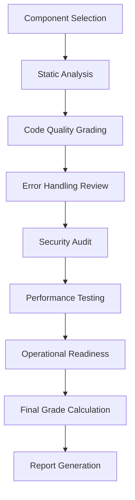

# 🚀 PHOENIX ORCH PRODUCTION GRADING PLAN
# SpaceX-Style Systematic Evaluation

## 🎯 Evaluation Strategy
*"We will examine every component as if it's going to Mars. No stone left unturned."* - Elon Musk

## 📋 Evaluation Phases

### Phase 1: Core Infrastructure (Mission-Critical)
1. **error-handling-rs** - System-wide resilience framework
2. **config-rs** - Configuration management
3. **shared-types-rs** - Common type system
4. **action-ledger-rs** - Immutable action logging

### Phase 2: Control Plane (The Brain)
5. **orchestrator-service-rs** - Central nervous system
6. **data-router-rs** - Neural bus and service discovery
7. **context-manager-rs** - Working memory
8. **reflection-service-rs** - Meta-cognition
9. **scheduler-rs** - Time management

### Phase 3: RSI Layer (Self-Improvement)
10. **log-analyzer-rs** - Learning input analysis
11. **curiosity-engine-rs** - Knowledge drive

### Phase 4: Cognitive Layer (The Soul)
12. **mind-kb-rs** - Facts & logic
13. **body-kb-rs** - Physical state
14. **heart-kb-rs** - Emotion tracking
15. **social-kb-rs** - Identity management
16. **soul-kb-rs** - Ethics enforcement
17. **persistence-kb-rs** - Self-preservation

### Phase 5: Functional Layer (The Body)
18. **llm-service-rs** - LLM interface
19. **tools-service-rs** - External tool execution
20. **safety-service-rs** - Input/output filtering
21. **logging-service-rs** - Centralized telemetry
22. **executor-rs** - Windows native execution

### Phase 6: Security & Infrastructure
23. **auth-service-rs** - Identity provider
24. **secrets-service-rs** - Secure vault
25. **api-gateway-rs** - External interface

### Phase 7: Specialized Components
26. **agent-registry-rs** - Team management
27. **input-validation-rs** - Validation framework
28. **tool-sdk** - Tool development kit

## 🔍 Evaluation Checklist per Component

### 1. **Code Analysis**
- [ ] Code quality metrics (clippy warnings, formatting)
- [ ] Test coverage analysis
- [ ] Documentation completeness
- [ ] Dependency analysis
- [ ] Build configuration review

### 2. **Error Handling Review**
- [ ] Circuit breaker implementation
- [ ] Retry logic and backoff strategies
- [ ] Fallback mechanisms
- [ ] Error reporting and logging
- [ ] Graceful degradation patterns

### 3. **Security Audit**
- [ ] Authentication/authorization mechanisms
- [ ] Data validation and sanitization
- [ ] Secret management
- [ ] Attack surface analysis
- [ ] Vulnerability assessment

### 4. **Performance Testing**
- [ ] Benchmark analysis
- [ ] Resource utilization
- [ ] Scalability assessment
- [ ] Bottleneck identification
- [ ] Optimization opportunities

### 5. **Operational Readiness**
- [ ] Monitoring and metrics
- [ ] Logging and tracing
- [ ] Alerting configuration
- [ ] Deployment process
- [ ] Disaster recovery procedures

## 🚀 Critical Component Deep Dives

### **error-handling-rs** - System Resilience
- Circuit breaker patterns
- Retry strategies with exponential backoff
- Fallback mechanisms
- Error classification and reporting
- Supervisor patterns for process recovery

### **executor-rs** - Windows Native Execution
- Sandbox implementation
- Process isolation and resource limits
- Command validation and allowlisting
- Error sanitization
- Security boundaries

### **auth-service-rs** - Security Core
- JWT implementation and validation
- RBAC enforcement
- mTLS certificate management
- Audit logging
- Rate limiting and abuse prevention

### **api-gateway-rs** - External Interface
- Request validation and sanitization
- Rate limiting
- Authentication integration
- Error handling and response formatting
- Security headers and CORS

### **data-router-rs** - System Nervous System
- Service discovery mechanisms
- Load balancing strategies
- Circuit breaking for downstream services
- Retry and fallback logic
- Performance optimization

## 📊 Grading Workflow

## 🎯 Success Metrics
- **Target**: 90% of components graded A or B
- **Minimum**: No component graded F
- **Critical**: All security components graded A or higher
- **Resilience**: All core infrastructure graded B or higher

## ⏱️ Timeline Estimate
- **Phase 1 (Core Infrastructure)**: 2-3 hours
- **Phase 2 (Control Plane)**: 3-4 hours
- **Phase 3 (RSI Layer)**: 1-2 hours
- **Phase 4 (Cognitive Layer)**: 4-5 hours
- **Phase 5 (Functional Layer)**: 3-4 hours
- **Phase 6 (Security)**: 2-3 hours
- **Phase 7 (Specialized)**: 1-2 hours
- **Report Synthesis**: 2-3 hours

**Total Estimate**: 18-26 hours for comprehensive evaluation

## 🚨 High-Risk Components (Priority Focus)
1. **executor-rs** - Windows native execution security
2. **auth-service-rs** - Authentication and authorization
3. **api-gateway-rs** - External attack surface
4. **data-router-rs** - System reliability
5. **context-manager-rs** - Memory consistency

## 📋 Evaluation Tools & Techniques
- **Static Analysis**: cargo clippy, cargo audit
- **Code Coverage**: tarpaulin or similar
- **Performance**: criterion benchmarks
- **Security**: cargo audit, manual review
- **Documentation**: cargo doc, manual review

## 🎯 Final Deliverables
1. **Component-by-Component Grading Report**
2. **Critical Issues List with Severity**
3. **Production Readiness Assessment**
4. **Actionable Recommendations**
5. **Prioritized Remediation Plan**