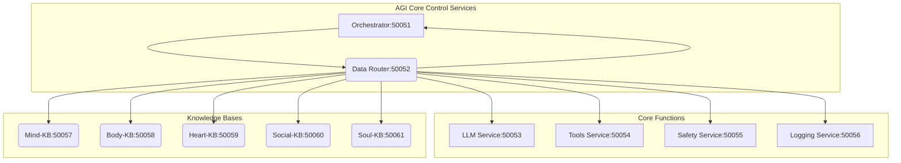

That's a fantastic idea\! A comprehensive `README.md` is essential for documenting your completed architecture.

Based on all the work we've done—from the initial 11-service design and Protobuf definitions to the final Docker containerization and orchestration logic—here is the complete `README.md` for your **Master Orchestrator AGI System**.

-----

# 🧠 Master Orchestrator AGI System: Blueprint

The **Master Orchestrator AGI System** is a modular, high-performance microservice architecture designed to handle complex, multi-modal, and autonomous tasks. It serves as a fully containerized blueprint for building agentic AI, leveraging gRPC for inter-service communication and Rust for stability and speed.

## 🌟 Key Features

  * **11 Microservices:** A complete architecture covering Control, Intelligence, Action, Safety, Utility, and five specialized Knowledge Bases (KBs).
  * **Decoupled Control Plane:** The **Orchestrator** and **Data Router** manage all planning, routing, and execution, maintaining separation of concerns.
  * **Thread-Safe Clients:** All inter-service communication utilizes the `Arc<Mutex<Option<Client>>>` pattern for highly concurrent, non-blocking routing.
  * **Containerized Deployment:** Ready for production scaling via Docker Compose, Docker Swarm, or Kubernetes.
  * **4-Phase AGI Loop:** Implements intelligent planning, safety validation, execution, and response aggregation.

## 🚀 Architecture Overview

The system is organized into a single **Rust Workspace** containing 11 packages, all communicating over gRPC ports **50051** through **50061**. All services are on the shared `agi_network`.

### A. Control Services (The Brain)

| Service | Port | Description | Core Logic Implemented |
| :--- | :--- | :--- | :--- |
| **Orchestrator** | 50051 | **The Entry Point.** Executes the 4-phase AGI loop: Planning, Safety Check, Execution, Aggregation. | **Functional Orchestration Logic** |
| **Data Router** | 50052 | **The Central Hub.** Routes all requests to 9 downstream services. Manages 9 thread-safe gRPC client stubs. | **100% Dynamic Routing Logic** |

### B. Core Functional Services

| Service | Port | Role | Core Methods Routed |
| :--- | :--- | :--- | :--- |
| **LLM Service** | 50053 | Provides natural language processing, planning, and generation. | `generate_text`, `process`, `embed_text` |
| **Tools Service** | 50054 | Interface for external actions (e.g., Web Search, APIs, code execution). | `execute_tool`, `list_tools` |
| **Safety Service** | 50055 | Policy enforcement, threat detection, and ethical constraint validation. | `check_policy`, `validate_request`, `check_threat` |
| **Logging Service** | 50056 | Centralized telemetry, logging, and metrics collection. | `log`, `get_metrics` |

### C. Knowledge Bases (KBs)

All KBs share the common `KnowledgeBaseService` interface (`query_kb`, `store_fact`, `retrieve`).

| Service | Port | Specialization |
| :--- | :--- | :--- |
| **Mind-KB** | 50057 | Short-term, episodic, and declarative memory. |
| **Body-KB** | 50058 | Physical/digital embodiment state, sensor data, and environment context. |
| **Heart-KB** | 50059 | Personality traits, emotional state, and motivational drives. |
| **Social-KB** | 50060 | Social dynamics, relationship history, and trust scores. |
| **Soul-KB** | 50061 | Core values, long-term goals, and fundamental identity. |

## 📐 Core Workflow Visualization

The following Mermaid diagram illustrates the flow of communication. All primary communication (solid lines) must pass through the **Data Router** (DR).



-----

## 🛠️ Installation and Deployment

The entire system is containerized and managed via `docker-compose.dev.yml`.

### Prerequisites

1.  **Rust:** The Rust toolchain (for local development/compilation).
2.  **Docker:** Docker Desktop or Docker Engine (for building and running containers).
3.  **Protobuf:** Protobuf compiler (`protoc`) is required for code generation (handled in the Dockerfiles).

### 1\. Build and Run

From the root directory, use the provided Docker Compose file:

```bash
# 1. Build all 11 images (will take time due to multi-stage Rust builds)
docker-compose -f docker-compose.dev.yml build

# 2. Start all 11 services in detached mode
# The Data Router and Orchestrator clients will gracefully connect to the downstream services.
docker-compose -f docker-compose.dev.yml up -d

# 3. View logs (useful for debugging client connection status)
docker-compose -f docker-compose.dev.yml logs -f
```

### 2\. Testing the System Entry Point

Once running, the system can be tested by sending a gRPC request to the **Orchestrator** on port **50051**.

```bash
# Example using grpcurl (assuming agi_core.proto is available)
# This tests the full path: Orchestrator -> Data Router -> LLM Service Stub
grpcurl -plaintext localhost:50051 agi_core.OrchestratorService/PlanAndExecute
```

-----

## 💡 Implementation Phases

The project has reached **Phase 3 Completion**. All structural components are in place and function as designed.

| Phase | Description | Status | Next Steps |
| :--- | :--- | :--- | :--- |
| **Phase 1** | Protobuf Definition & Service Scaffolding | COMPLETE | N/A |
| **Phase 2** | 11-Service Stub Implementation & Containerization | COMPLETE | N/A |
| **Phase 3** | Data Router & Orchestrator Core Logic Implementation | COMPLETE | N/A |
| **Phase 4** | **Deep Business Logic Integration** | **PENDING** | Implement LLM API, Vector DBs, Tool Executors, and Safety Policies. |

### Focus for Phase 4 (Deep Logic)

| Service | Phase 4 Integration |
| :--- | :--- |
| **LLM Service** (50053) | Connect to an external LLM API (e.g., Gemini, GPT). |
| **Knowledge Bases** (50057-61) | Integrate with a **Vector Database** (e.g., Qdrant) for semantic search and persistence. |
| **Tools Service** (50054) | Implement actual external REST/RPC calls for defined tools. |

## 📝 Master System Prompt (for LLM Planning)

The **Master System Prompt** is the definitive instruction set used by the **Orchestrator** to guide the **LLM Service's** planning phase. It enforces structured JSON output, safety checks, and strategic use of the Knowledge Bases. Refer to the documentation to guide its future behavior.

-----