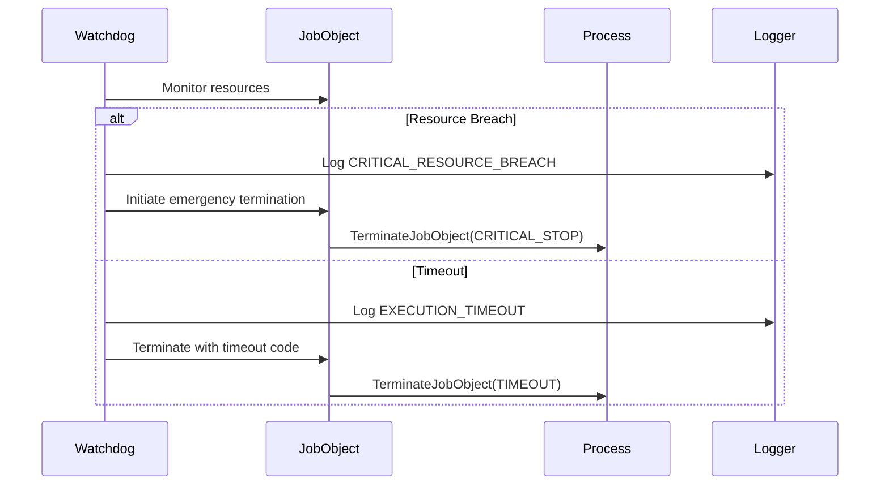
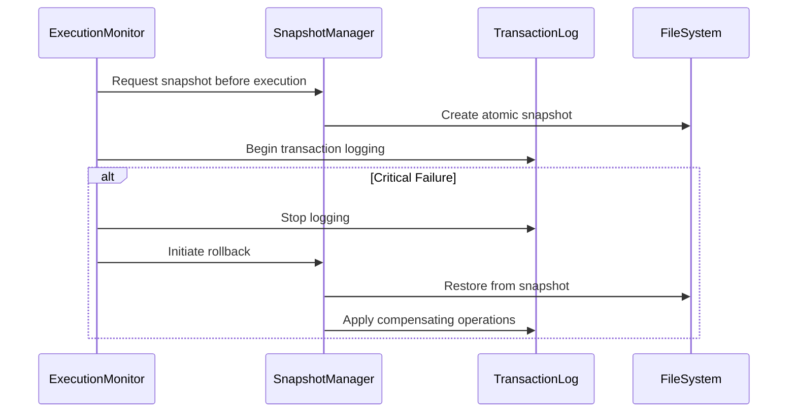
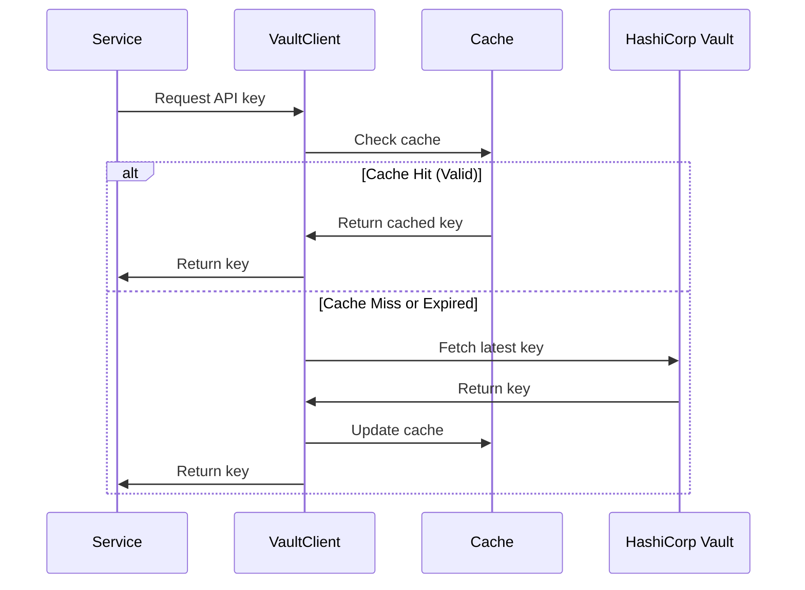

# Emergency Resilience Technical Specification

## Overview

This document outlines the technical specifications for implementing emergency resilience features in the Phoenix ORCH system, focusing on three core components:

1. Process Watchdog (Kill Switch)
2. Data Integrity Rollback
3. Unified Secret Management

## 1. Process Watchdog Architecture

### 1.1 Enhanced JobObjectManager

The existing `JobObjectManager` in `windows_executor.rs` will be enhanced with additional monitoring capabilities:

```rust
pub struct JobObjectManager {
    job_handle: HANDLE,
    sandbox_path: PathBuf,
    resource_monitor: ResourceMonitor,
    failure_logger: FailureLogger,
}

struct ResourceMonitor {
    cpu_usage: Arc<AtomicU64>,
    memory_usage: Arc<AtomicU64>,
    execution_time: Arc<AtomicU64>,
    last_check: Arc<Mutex<Instant>>,
}

struct FailureLogger {
    log_path: PathBuf,
    critical_events: Arc<RwLock<Vec<CriticalEvent>>>,
}
```

### 1.2 Resource Limits

Strict resource boundaries:
- Execution time: 10 seconds maximum
- CPU usage: 50% per core limit
- Memory usage: 50% of available RAM
- Process count: Maximum 5 concurrent processes

### 1.3 Critical Failure Detection

Monitoring points:
1. Resource limit breaches
2. Execution timeouts
3. Process crashes
4. Security violations
5. Memory access violations

### 1.4 Emergency Termination Protocol



## 2. Data Integrity Rollback System

### 2.1 KB Snapshot Mechanism

```rust
pub struct KBSnapshot {
    snapshot_id: Uuid,
    timestamp: DateTime<Utc>,
    data_path: PathBuf,
    metadata: HashMap<String, String>,
    checksum: [u8; 32],
}

pub struct SnapshotManager {
    storage_path: PathBuf,
    max_snapshots: usize,
    current_snapshot: Arc<RwLock<Option<KBSnapshot>>>,
}
```

### 2.2 Transaction Log

```rust
pub struct TransactionLog {
    log_id: Uuid,
    operations: Vec<Operation>,
    timestamp: DateTime<Utc>,
    snapshot_id: Uuid,
}

pub enum Operation {
    Create { path: PathBuf, content: Vec<u8> },
    Modify { path: PathBuf, patches: Vec<Patch> },
    Delete { path: PathBuf, backup: Vec<u8> },
}
```

### 2.3 Rollback Procedure



## 3. Unified Secret Management

### 3.1 Vault Client Integration

```rust
pub struct VaultClient {
    client: vaultrs::client::VaultClient,
    cache: Arc<RwLock<SecretCache>>,
    config: VaultConfig,
}

struct SecretCache {
    entries: HashMap<String, CachedSecret>,
    max_age: Duration,
}

struct CachedSecret {
    value: String,
    expiry: DateTime<Utc>,
    version: u64,
}
```

### 3.2 API Key Retrieval Flow



### 3.3 Secret Rotation

- Automatic rotation every 30 days
- Immediate rotation on suspected compromise
- Version tracking for rollback capability
- Graceful service updates with no downtime

## Failure Scenarios and Recovery

### Critical Failure Categories

1. Resource Exhaustion
   - Trigger: CPU > 50% or Memory > 50%
   - Action: Emergency termination + rollback
   - Recovery: Restore from last snapshot

2. Security Breach
   - Trigger: Sandbox escape attempt
   - Action: Kill all related processes
   - Recovery: Security audit + rollback

3. Data Corruption
   - Trigger: Checksum mismatch
   - Action: Halt operations
   - Recovery: Restore from verified snapshot

4. Secret Compromise
   - Trigger: Unusual access patterns
   - Action: Immediate key rotation
   - Recovery: Reissue all dependent tokens

## Implementation Phases

1. Phase 1: Process Watchdog
   - Enhance JobObjectManager
   - Implement resource monitoring
   - Add critical failure logging

2. Phase 2: Data Integrity
   - Implement snapshot system
   - Add transaction logging
   - Create rollback mechanisms

3. Phase 3: Secret Management
   - Integrate vaultrs
   - Implement caching layer
   - Add rotation mechanisms

## Security Considerations

1. Isolation
   - Strict process boundaries
   - Sandbox containment
   - Memory protection

2. Audit Trail
   - Comprehensive logging
   - Resource usage tracking
   - Security event monitoring

3. Access Control
   - Principle of least privilege
   - Token-based authentication
   - Role-based authorization

## Monitoring and Alerting

### Metrics to Track

1. Resource Usage
   - CPU utilization
   - Memory consumption
   - Process count
   - Execution duration

2. Security Events
   - Authentication attempts
   - Permission violations
   - Sandbox breaches

3. System Health
   - Snapshot status
   - Transaction log integrity
   - Secret rotation status

### Alert Thresholds

1. Critical Alerts
   - CPU > 45% (pre-emptive)
   - Memory > 45% (pre-emptive)
   - Execution time > 8s (warning)
   - Failed rollback attempts

2. Security Alerts
   - Multiple authentication failures
   - Unauthorized access attempts
   - Unusual secret access patterns

## Testing Strategy

1. Unit Tests
   - Resource limit enforcement
   - Rollback functionality
   - Secret management operations

2. Integration Tests
   - End-to-end recovery scenarios
   - Cross-component interaction
   - Performance under load

3. Chaos Testing
   - Random process termination
   - Resource exhaustion simulation
   - Network partition handling