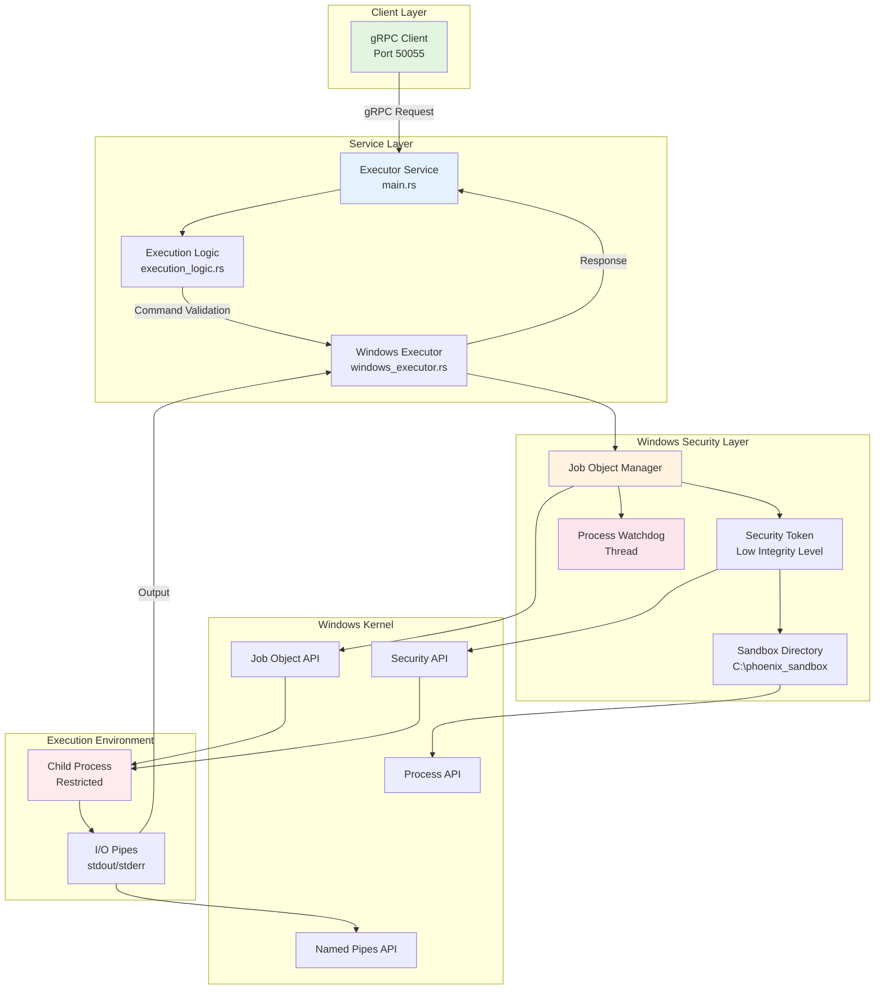
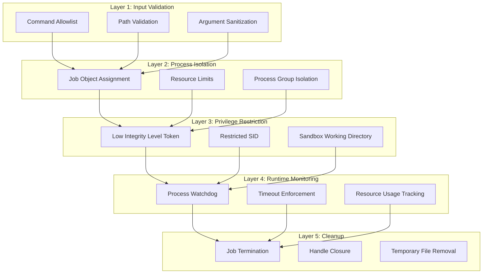
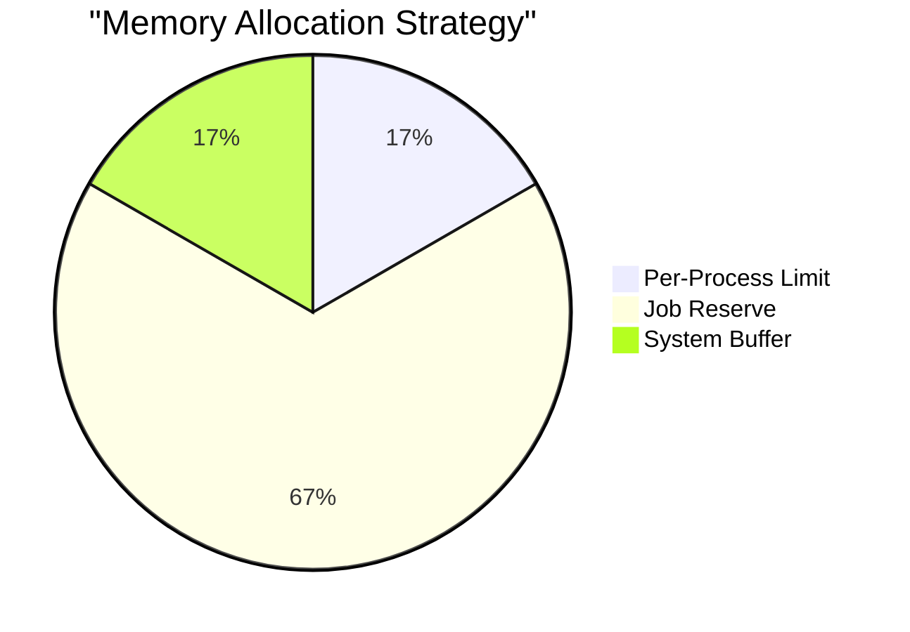
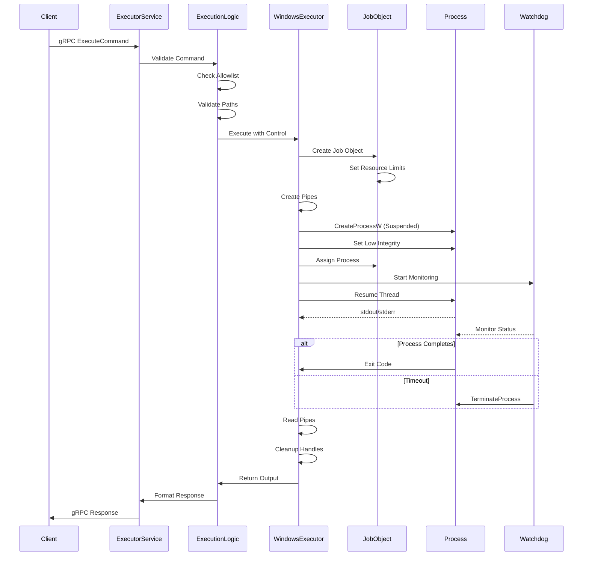
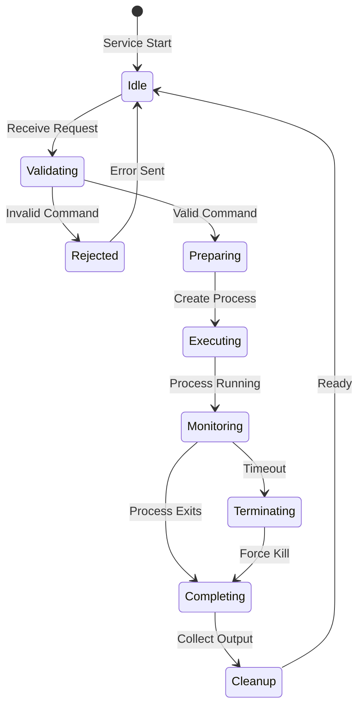

# PHOENIX ORCH: The Ashen Guard Edition AGI
# Executor-RS Windows Native Execution Architecture

## Table of Contents
1. [Overview](#overview)
2. [Architecture Diagram](#architecture-diagram)
3. [Core Components](#core-components)
4. [Security Model](#security-model)
5. [Resource Management](#resource-management)
6. [Process Lifecycle](#process-lifecycle)
7. [Technical Specifications](#technical-specifications)
8. [API Contracts](#api-contracts)

---

## Overview

The Executor-RS service has been refactored from a Docker-based containerized approach to a **Windows native execution model** leveraging low-level Windows APIs for enhanced security and resource control. This architecture provides sandboxed code execution with fine-grained resource limits and security boundaries.

### Key Design Principles
- **Native Windows Integration**: Direct use of Windows Job Objects and security tokens
- **Defense in Depth**: Multiple security layers including Low Integrity Level, Job Objects, and sandbox isolation
- **Resource Isolation**: Hard limits on memory, CPU, and process count
- **Process Monitoring**: Real-time watchdog threads for timeout enforcement
- **Output Capture**: Pipe-based stdout/stderr redirection for complete visibility

### Service Endpoints
- **gRPC Port**: 50055 (as per PHOENIX ORCH service architecture)
- **Protocols**: gRPC with Protocol Buffers
- **Sandbox Location**: `C:\phoenix_sandbox`

---

## Architecture Diagram



---

## Core Components

### 1. Job Object Manager
**Location**: [`windows_executor.rs:56-124`](executor-rs/src/windows_executor.rs:56)

The Job Object Manager is the central component for process isolation and resource management.

#### Responsibilities
- Creates Windows Job Objects with strict resource limits
- Assigns processes to Job Objects for lifecycle management
- Enforces resource constraints at the kernel level
- Ensures automatic cleanup of child processes

#### Key Features
```rust
pub struct JobObjectManager {
    job_handle: HANDLE,           // Windows Job Object handle
    sandbox_path: PathBuf,        // Sandbox directory path
}
```

#### Resource Limits
- **Process Memory**: 100 MB per process
- **Job Memory**: 500 MB total for all processes
- **Process Count**: Maximum 5 concurrent processes
- **Kill on Close**: Automatic termination when job closes

### 2. Process Watchdog Thread
**Location**: [`windows_executor.rs:490-565`](executor-rs/src/windows_executor.rs:490)

A dedicated monitoring thread that enforces execution timeouts and tracks process health.

#### Functionality
- Spawned for each executed process
- Monitors process lifecycle in 100ms intervals
- Enforces 30-second execution timeout
- Automatic termination on timeout exceeded
- Periodic status logging for debugging

#### Implementation
```rust
fn start_watchdog(&self, process_handle: HANDLE, process_id: DWORD) -> JoinHandle<()> {
    // Duplicate handles for thread safety
    // Monitor process status
    // Enforce timeout limits
    // Clean up on completion
}
```

### 3. Security Token Management
**Location**: [`windows_executor.rs:383-450`](executor-rs/src/windows_executor.rs:383)

Implements Low Integrity Level tokens to restrict process privileges.

#### Security Features
- Opens process token with adjustment privileges
- Creates Low Integrity Level Security Identifier (SID)
- Applies integrity level using `SetTokenInformation`
- Restricts file system and registry access

#### Current Status
⚠️ **Note**: Testing report indicates incomplete implementation. The integrity level is created but not fully applied.

### 4. Output Capture System
**Location**: [`windows_executor.rs:186-336`](executor-rs/src/windows_executor.rs:186)

Pipe-based I/O redirection for complete output visibility.

#### Architecture
```
Process Creation → Anonymous Pipes → Output Buffers → Response
         ↓              ↓                ↓              ↓
    CreateProcessW  CreatePipe      ReadFile     gRPC Response
```

#### Features
- Creates anonymous pipes for stdout/stderr
- Non-blocking pipe reading
- 4KB buffer chunks for streaming
- UTF-8 encoding with fallback for binary data

### 5. Command Validation Layer
**Location**: [`execution_logic.rs:21-53`](executor-rs/src/execution_logic.rs:21)

Pre-execution validation and sanitization.

#### Validation Steps
1. **Command Allowlist**: Validates against permitted commands
2. **Path Validation**: Ensures files stay within sandbox
3. **Argument Sanitization**: Checks for path traversal attempts
4. **Error Sanitization**: Removes sensitive information from errors

#### Allowed Commands
```rust
static ALLOWED_COMMANDS: Vec<String> = vec![
    "ls", "dir", "cat", "type", "echo", "cd", "pwd", "mkdir",
    "python", "python3", "pip", "pip3",
    "grep", "find", "findstr",
    "cmd", "powershell"
];
```

---

## Security Model

### Multi-Layer Defense Strategy



### Security Boundaries

1. **Filesystem Isolation**
   - Working directory: `C:\phoenix_sandbox`
   - Path validation for all file operations
   - No access to system directories (except whitelisted binaries)

2. **Process Isolation**
   - Separate process group for each execution
   - Job Object enforced process tree
   - Automatic termination of child processes

3. **Privilege Restrictions**
   - Low Integrity Level (when fully implemented)
   - No network access (planned)
   - Limited registry access

4. **Resource Boundaries**
   - Hard memory limits (100MB/process, 500MB/job)
   - Process count restrictions (max 5)
   - CPU usage limits (configurable)
   - Execution timeout (30 seconds)

---

## Resource Management

### Memory Management



| Resource | Limit | Scope | Enforcement |
|----------|-------|-------|-------------|
| Process Memory | 100 MB | Per Process | Job Object API |
| Job Memory | 500 MB | All Processes | Job Object API |
| Handle Count | System Default | Per Process | Windows Kernel |
| Thread Count | System Default | Per Process | Windows Kernel |

### CPU Management

- **CPU Rate**: Configurable (currently 50% of one core)
- **Priority**: Normal (inherits from parent)
- **Affinity**: All cores (default)
- **Quantum**: System default

### Process Limits

```rust
const MAX_PROCESS_COUNT: DWORD = 5;        // Concurrent processes
const EXECUTION_TIMEOUT_MS: u64 = 30000;   // 30 seconds
```

---

## Process Lifecycle

### Execution Flow



### State Transitions



---

## Technical Specifications

### Windows API Dependencies

| API | Header | Purpose |
|-----|--------|---------|
| `CreateJobObjectW` | jobapi2.h | Job Object creation |
| `SetInformationJobObject` | jobapi2.h | Resource limit configuration |
| `AssignProcessToJobObject` | jobapi2.h | Process assignment |
| `CreateProcessW` | processthreadsapi.h | Process creation |
| `OpenProcessToken` | processthreadsapi.h | Token manipulation |
| `SetTokenInformation` | securitybaseapi.h | Integrity level |
| `CreatePipe` | namedpipeapi.h | I/O redirection |
| `WaitForSingleObject` | synchapi.h | Process synchronization |

### System Requirements

| Component | Requirement |
|-----------|-------------|
| OS | Windows 10/11 or Server 2016+ |
| Architecture | x64 |
| Memory | Minimum 1GB available |
| Disk | 100MB for sandbox |
| Privileges | Standard user (Low IL applied) |
| Runtime | Visual C++ Redistributables |

### Configuration Parameters

```rust
// Resource Limits
const MAX_PROCESS_MEMORY: SIZE_T = 100 * 1024 * 1024;  // 100 MB
const MAX_JOB_MEMORY: SIZE_T = 500 * 1024 * 1024;      // 500 MB
const MAX_PROCESS_COUNT: DWORD = 5;                     // 5 processes
const EXECUTION_TIMEOUT_MS: u64 = 30000;                // 30 seconds

// Paths
const SANDBOX_DIR: &str = r"C:\phoenix_sandbox";

// Monitoring
const WATCHDOG_INTERVAL_MS: u64 = 100;                  // 100ms checks
const STATUS_LOG_INTERVAL_S: u64 = 5;                   // 5s status logs
```

### Error Handling

| Error Type | Handling | User Message |
|------------|----------|--------------|
| Command Not Allowed | Reject | "Command not permitted" |
| Path Escape | Reject | "Access denied" |
| Resource Limit | Terminate | "Resource limit exceeded" |
| Timeout | Terminate | "Process timeout" |
| API Failure | Log & Sanitize | "Execution failed" |

---

## API Contracts

### gRPC Service Definition

```protobuf
service ExecutorService {
    rpc ExecuteCommand(CommandRequest) returns (CommandResponse);
    rpc SimulateInput(InputRequest) returns (InputResponse);
}

message CommandRequest {
    string command = 1;
    repeated string args = 2;
    map<string, string> env = 3;
}

message CommandResponse {
    string stdout = 1;
    string stderr = 2;
    int32 exit_code = 3;
}
```

### Internal API

```rust
// Main execution entry point
pub async fn execute_with_windows_control(
    command: &str,
    args: &[String],
    env_vars: &HashMap<String, String>,
    language: &str,
) -> Result<(String, String, i32), String>

// Job Object Manager
impl JobObjectManager {
    pub fn new() -> Result<Self, String>
    pub async fn execute_code(...) -> Result<(String, String, i32), String>
    fn set_low_integrity_level(&self, handle: HANDLE) -> Result<(), String>
    fn start_watchdog(&self, handle: HANDLE, pid: DWORD) -> JoinHandle<()>
}
```

---

## Performance Characteristics

### Overhead Analysis

| Operation | Typical Duration | Notes |
|-----------|-----------------|--------|
| Job Object Creation | ~5ms | One-time per execution |
| Process Creation | ~50ms | Includes suspension/resume |
| Token Modification | ~2ms | Security overhead |
| Pipe Creation | ~1ms | Per execution |
| Watchdog Thread | ~1ms | Spawn overhead |
| Total Overhead | ~60ms | Before actual execution |

### Scalability Limits

- **Concurrent Executions**: Limited by process count (5)
- **Memory Footprint**: 500MB maximum for all processes
- **Handle Consumption**: ~10 handles per execution
- **Thread Count**: 1 watchdog thread per execution

---

## Known Issues and Limitations

### Current Issues
1. **Low Integrity Level**: Implementation incomplete (only logs, doesn't apply)
2. **Output Capture**: Fully implemented with pipe-based capture
3. **Path Validation**: Function exists but not integrated in execution flow
4. **Network Isolation**: Not implemented
5. **CPU Rate Limiting**: Configuration present but not enforced

### Design Limitations
1. **Fixed Limits**: All resource limits are compile-time constants
2. **Windows Only**: No Linux/Mac compatibility
3. **Synchronous Pipes**: May block on large outputs
4. **Single Sandbox**: All processes share one sandbox directory

---

## Future Enhancements

### Planned Features
1. **Dynamic Configuration**: Runtime adjustable limits
2. **Network Isolation**: Windows Firewall API integration
3. **Per-User Sandboxes**: Isolated directories per session
4. **Metrics Collection**: Resource usage tracking
5. **Distributed Execution**: Multi-node job distribution

### Security Roadmap
1. Complete Low Integrity Level implementation
2. Add AppContainer isolation
3. Implement Windows Defender integration
4. Add audit logging with Windows Event Log
5. Certificate-based process signing

---

*Architecture Document Version: 1.0*
*Last Updated: 2025-12-10*
*System: PHOENIX ORCH - The Ashen Guard Edition AGI*